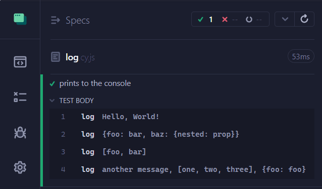

# cypress-log

> Intelligible package that overrides the default behavior of the `cy.log()` method by giving the ability to print whatever you want not only in Cypress Runner UI but in the terminal as well. This is super useful when you don't want to handle what to invoke a built-in command or a task, but you still want to use one command for logging everything everywhere.

## Install

```shell
npm install -D cypress-log
```

## Usage

In your `cypress/support/e2e.js` file, add the following:

```js
import 'cypress-log';
```

Also, you need to add the following to your `cypress.config.js` file:

```js
// import the log function
const { log } = require('cypress-log/log.task');

module.exports = {
  // ...
  e2e: {
    setupNodeEvents(on, config) {
      // add the function to the task
      on('task', { log });
    },
  },
  // ...
};
```

Then, you can use the `cy.log` command in your tests as you've used to do it before. For example:

```js
cy.log('Hello, World!');
cy.log({ foo: 'bar', baz: { nested: 'prop' } });
cy.log(['foo', 'bar']);
cy.log('another message', ['one', 'two', 'three'], { foo: 'foo' });
```

So, if you run your tests in the Cypress Runner UI, you will see the following:



and if you run your tests in non-interactive mode, you will see the following in the terminal:


## Author

Yevhen Laichenkov <elaichenkov@gmail.com>

## License

[MIT](./LICENSE)
